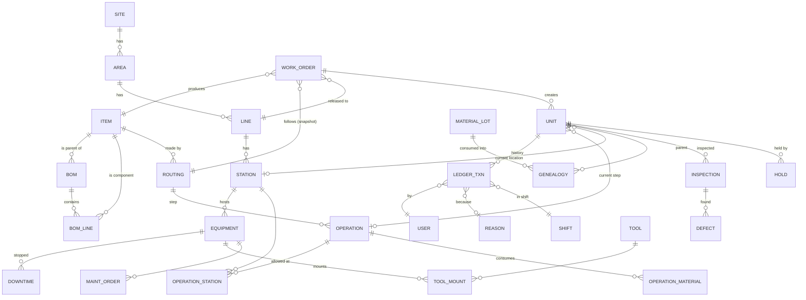

# 4) نموذج البيانات والعلاقات

## 4.1 قواعد النقل بين SQLite و PostgreSQL (إجبارية من أول سطر)

دي القواعد اللي بتضمن إن التحول لـPostgreSQL يبقى "تغيير إعداد" مش "إعادة كتابة".

| # | القاعدة | السبب |
|---|---|---|
| P1 | **المفاتيح:** كل كيان مفتاحه `id` من نوع UUIDv7 (عبر نوع SQLAlchemy `Uuid`)، + كود بشري منفصل فريد (`code`) | UUIDv7 مرتب زمنيًا (فهارس سريعة)، ومحمول، ومش بيتعارض عند دمج مصانع أو استيراد |
| P2 | **الكميات أعداد صحيحة:** `qty` = `BIGINT` بمضاعف 10⁶ (micro-units)، والـAPI بيحولها لـDecimal | SQLite مفيهاش Decimal حقيقي؛ float في الكميات = أرقام مش بتتقفل. **ولا float في أي كمية أو قياس مخزن** |
| P3 | **الوقت:** UTC دايمًا عبر TypeDecorator واحد؛ مفيش `CURRENT_TIMESTAMP` من القاعدة — الوقت بييجي من التطبيق | سلوك الوقت مختلف بين القاعدتين |
| P4 | **مفيش منطق أعمال في القاعدة** (لا stored procedures ولا triggers للمنطق). الاستثناء الوحيد: trigger حماية يرفض UPDATE/DELETE على الدفتر، مكتوب للقاعدتين ومختبر | المنطق في Python = نفس السلوك في كل مكان |
| P5 | **JSON مسموح للحقول الإضافية فقط** (`attrs`)، وممنوع يدخل في شرط استعلام في منطق أساسي | دعم JSON في الاستعلامات مختلف |
| P6 | **مفيش أنواع خاصة بقاعدة** (arrays، enums الخاصة بـPG، `ROWID`) | — |
| P7 | كل جدول فيه `site_id` | التوسع لعدة مصانع بعدين بدون ترحيل مؤلم |
| P8 | البيانات الأساسية: `is_active` بدل الحذف؛ + `version` لكل صف قابل للتعديل (optimistic lock) | التتبع التاريخي لازم يلاقي المنتج/المحطة حتى لو اتلغت |
| P9 | أسماء الجداول `snake_case` ببادئة الوحدة (`mdm_item`, `qms_inspection`) | عزل الوحدات وملكية الجداول |
| P10 | كل الاختبارات تشتغل على القاعدتين في كل commit | الطريقة الوحيدة الحقيقية لضمان P1–P9 |

---

## 4.2 خريطة الكيانات (مبسطة)



---

## 4.3 الجداول حسب الوحدة

### Kernel / SYS
| الجدول | الحقول الأساسية | ملاحظات |
|---|---|---|
| `sys_site` | id, code, name, timezone, prod_day_start (مثلًا 07:00) | |
| `sys_user` | id, site_id, login, display_name, badge_code, pwd_hash, pin_hash, is_active, locked_until | مفيش حذف |
| `sys_role`, `sys_user_role` | role → users | |
| `sys_permission` | role_id, screen_code, action (view/create/edit/delete/export/approve), scope_type, scope_id | نطاق: مصنع/منطقة/خط |
| `sys_device` | id, code, kind (office/station/board/edge), token_hash, station_id | أجهزة مسجلة |
| `sys_code_table`, `sys_code` | table_code (DOWNTIME_REASON…), code, label_ar, label_en, parent_code, attrs | قوائم قابلة للتعديل |
| `sys_sequence` | doc_type, pattern, next_value, reset_policy | الترقيم |
| `sys_audit` | id, at, user_id, table_name, row_id, action, before JSON, after JSON | تغييرات البيانات الأساسية |
| `sys_license` | payload, signature, installed_at | |
| `sys_setting` | key, value, scope | |
| `sys_outbox` | id, event_type, payload JSON, created_at, delivered_at | أحداث بعد الـcommit |
| `sys_command_log` | command_id (PK), command_type, received_at, result | **منع التكرار (idempotency)** |
| `sys_custom_field` | entity, field_code, type, label, required, options | حقول إضافية بيعرفها العميل بدون برمجة |

### Kernel / MDM
| الجدول | الحقول الأساسية |
|---|---|
| `mdm_area`, `mdm_line`, `mdm_station`, `mdm_equipment` | id, parent_id, code, name, is_active, attrs; المحطة: kind (manual/auto/inspection)؛ المعدة: ideal_cycle_time |
| `mdm_uom`, `mdm_uom_conversion` | وحدات القياس والتحويل |
| `mdm_item` | id, code, name, kind (FG/SFG/RM/CONS), base_uom, **tracking (none/lot/serial)**, shelf_life_days, attrs |
| `mdm_bom`, `mdm_bom_line` | bom: item_id, revision, valid_from/to, status؛ line: component_item_id, qty_per, scrap_pct, operation_seq |
| `mdm_routing` | item_id, revision, status (draft/approved/obsolete) |
| `mdm_operation` | routing_id, seq, code, name, std_cycle_time, is_inspection, is_mandatory, next_on_fail |
| `mdm_operation_station` | operation_id, station_id |
| `mdm_operation_material` | operation_id, item_id, qty_per, scan_required |
| `mdm_shift_pattern`, `mdm_shift`, `mdm_calendar_exception` | الورديات، الأيام، العطلات، الاستراحات المخططة |

### Kernel / EXE
| الجدول | الحقول الأساسية | ملاحظات |
|---|---|---|
| `exe_work_order` | id, code, item_id, routing_snapshot_id, bom_snapshot_id, line_id, qty_planned, qty_good, qty_scrap, status, priority, due_at, planned_date, erp_ref, version | الكميات هنا **projection** من الدفتر |
| `exe_routing_snapshot` | نسخة مجمدة من المسار والـBOM لحظة الإطلاق | تعديل المسار بعدين ميبوّظش أمر شغال |
| `exe_unit` | id, code (serial/lot no.), work_order_id, item_id, kind (serial/lot/container), qty, status (queued/in_process/completed/scrapped/held), current_op_seq, current_station_id, parent_container_id, version | **الحالة الحالية** (projection) |
| `exe_wip_balance` | work_order_id, op_seq, station_id, qty_queued, qty_in_process | projection للـWIP |
| **`exe_ledger_txn`** | انظر §4.4 | **الدفتر — مصدر الحقيقة** |

### الوحدات
| الوحدة | الجداول |
|---|---|
| **TRC** | `trc_material_lot` (item, lot_no, supplier_lot, qty, expiry, status)، `trc_genealogy` (parent_unit_id, child_unit_id أو material_lot_id, qty, txn_id) |
| **QMS** | `qms_plan`, `qms_characteristic` (nominal, lsl, usl, unit, sample_size)، `qms_inspection` (unit_id, plan_id, result, txn_id)، `qms_measurement` (inspection_id, characteristic_id, value BIGINT micro)، `qms_defect` (unit_id, defect_code, location, qty, txn_id)، `qms_hold` (target_type, target_id, reason, held_txn_id, released_txn_id, disposition)، `qms_ncr` |
| **SPC** | `spc_chart_def`, `spc_subgroup`, `spc_violation` |
| **OEE** | `oee_state_event` (equipment_id, state: run/idle/down/setup/planned_stop, start_at, end_at, reason_code, source: manual/machine)، `oee_counter` (equipment_id, bucket_start, good, total)، `oee_period_result` (equipment/line, shift, A, P, Q, OEE) |
| **TOOL** | `tool_tool` (code, kind, max_shots, current_shots, status)، `tool_mount` (tool_id, equipment_id, mounted_at, unmounted_at)، `tool_item_link` |
| **CMMS** | `cmms_pm_plan` (trigger: time/counter)، `cmms_order` (kind: PM/breakdown, equipment_id, status, downtime_event_id)، `cmms_spare`, `cmms_spare_move` |
| **LBR** | `lbr_skill`, `lbr_user_skill` (valid_to)، `lbr_station_requirement`، `lbr_attendance` (user, station, from, to) |
| **APS** | `aps_plan`, `aps_slot` (work_order_id, line_id, start, end, sequence, locked)، `aps_changeover_matrix` |
| **ALM** | `alm_rule` (event/condition, severity, escalation steps)، `alm_alarm` (rule_id, source, raised_at, ack_by, ack_at, closed_at)، `alm_notification` |
| **LBL** | `lbl_template` (zpl مع متغيرات)، `lbl_printer`، `lbl_print_log` (template, unit_id, printed_by, reprint_reason) |
| **INV** | `inv_location`, `inv_balance`, `inv_move` |
| **EDGE** | `edge_connector` (kind: opcua/mqtt/modbus, endpoint, cred_ref)، `edge_tag_map` (tag → equipment_id + signal: count/state/value) |

---

## 4.4 دفتر الحركات (Ledger) — التفاصيل

```
exe_ledger_txn
─────────────────────────────────────────────────────────────────────────
seq               BIGINT   PK, متزايد بدون فجوات (يديره الكاتب الواحد)
id                UUID     فريد
site_id           UUID
txn_type          TEXT     CREATE_UNIT | TRACK_IN | TRACK_OUT | SCRAP | REWORK |
                           SPLIT | MERGE | CONSUME | HOLD | RELEASE | MOVE |
                           COMPLETE | REVERSE | ADJUST | ...
command_id        UUID     الأمر اللي ولّد الحركة (idempotency)
unit_id           UUID     القطعة/اللوت
work_order_id     UUID
item_id           UUID
op_seq            INT      الخطوة
station_id        UUID
equipment_id      UUID     nullable
qty               BIGINT   micro-units، بإشارة (+/-)
reason_code       TEXT     nullable
reverses_seq      BIGINT   nullable — لو دي حركة عكسية
user_id           UUID     مين (أو مستخدم آلي للماكينة)
device_id         UUID     من أنهي جهاز
occurred_at       TIMESTAMP (UTC، ساعة السيرفر)
client_at         TIMESTAMP (ساعة الجهاز — للمعلومة)
production_date   DATE     يوم الإنتاج (محسوب من الوردية)
shift_code        TEXT
payload           JSON     تفاصيل إضافية حسب النوع
prev_hash         BLOB(32)
hash              BLOB(32) = SHA-256( prev_hash ‖ canonical(كل الحقول فوق) )
```

### ضمان عدم التلاعب — بصراحة وبدون مبالغة
1. **التطبيق** ميعرفش يعدل أو يمسح (مفيش كود لكده، والـAPI مفيهوش).
2. **القاعدة** بترفض UPDATE/DELETE على الجدول (trigger حماية).
3. **سلسلة الـHash:** أي تعديل في سطر قديم بيكسر كل اللي بعده؛ أداة `verify-ledger`
   بتكشفه وبتحدد أول سطر اتلعب فيه. بتشتغل تلقائيًا يوميًا وعلى كل نسخة احتياطية.
4. **المرساة اليومية (Anchor):** آخر Hash في كل يوم إنتاج بيتصدّر لبرا القاعدة (ملف
   في النسخ الاحتياطي + تقرير يومي مطبوع/مبعوت بالإيميل اختياريًا). كده حتى لو حد
   عنده صلاحية كاملة على الملف وأعاد حساب السلسلة كلها، المرساة الخارجية هتفضحه.

**الحقيقة المهمة:** ده نظام **يكشف** التلاعب (tamper-evident)، مش نظام **يستحيل** فيه
التلاعب. أي حد ماسك الجهاز فعليًا يقدر يمسح الملف كله — الحماية هنا هي النسخ
الاحتياطي والمرساة الخارجية. لازم نقول ده للعميل بوضوح وميتباعش على إنه "مستحيل".

### قاعدة حفظ الكمية (Conservation) — بتتفحص آليًا دايمًا
لكل أمر عمل ولكل خطوة:
```
الداخل للخطوة = الجيد الخارج + الفاقد + الموجود حاليًا في الخطوة (WIP) ± إعادة التشغيل
```
وأي حركة تكسر المعادلة بترفض. ده الحارس ضد "85 صف زيادة" و"كمية مكررة".

---

## 4.5 حالات أمر العمل والوحدة (State machines)

```
Work Order:  Draft ─► Released ─► InProgress ─► Completed ─► Closed
                 │         │            │
                 └─► Cancelled   └──► OnHold ◄──┘  (Hold/Release بسبب وتوقيع)

Unit:  Created ─► Queued@op ─TrackIn─► InProcess@op ─TrackOut(good)─► Queued@next-op … ─► Completed
                                              │
                                              ├─TrackOut(scrap)──► Scrapped
                                              ├─TrackOut(rework)─► Queued@rework-op
                                              └─(أي وقت) Hold ──► Held ─Release(disposition)─► (يرجع مكانه/Scrap/Rework)
```

الانتقالات المسموحة **مكتوبة كجدول بيانات في الكود** (مش if متناثرة)، والاختبارات
بتجرب كل انتقال ممنوع وتتأكد إنه بيترفض.

---

## 4.6 الحقول المخصصة (مطلب تجاري أساسي)

كل مصنع هيطلب "عايز خانة زيادة": لون، رقم عميل، رقم قالب. الحل:
- `sys_custom_field` بيعرّف الحقل (نوع، إلزامي، قائمة اختيارات).
- القيمة بتتخزن في `attrs` JSON للكيان.
- بيظهر تلقائيًا في الشاشات والفلاتر والتصدير.
- **مبيدخلش في منطق النواة أبدًا** — ده بيحمي الترقيات من تخصيصات العملاء.
